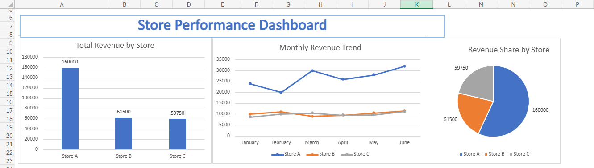

# Store Performance Analysis

## Problem
The company needs to identify which stores are meeting 
their revenue targets and which stores need improvement.

## Dataset
- 18 records — 3 stores × 6 months
- Stores: Store A (Electronics), Store B (Clothing), Store C (Food)
- Period: January 2024 — June 2024
- Columns: Month, Store, Category, Units Sold, Revenue, Target

## Tools Used
- Microsoft Excel
  - Pivot Table
  - Conditional Formatting
  - Dashboard (3 Charts)

## Key Findings
- Total Revenue: $281,250
- Store A generated $160,000 (57% of total revenue)
- Store B generated $61,500 (22% of total revenue)
- Store C generated $59,750 (21% of total revenue)
- Store A exceeded its target every single month
- Store B never reached its target in any month

## Decision & Recommendations
- Store A is the top performer and its strategy should 
  be studied and applied to other stores
- Store B needs an urgent review of its sales strategy
- Store C is stable but has room for improvement

## Dashboard

## Files
- Store_Analysis.xlsx
  - Raw Data : original dataset with conditional formatting
  - PivotTable : revenue summary by store and month
  - Dashboard : 3 charts showing performance overview
